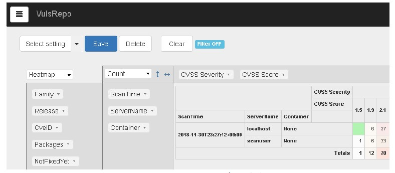

# [Vuls] 脆弱性情報収集検知システム管理者向け情報

## 1. システム稼働サーバー

### 1.1 ハイパーバイザー

- VMware vSphere ESXi6.0
- xxx.xxx.xxx.xxx
  - `VMware vSphere Client`を使用する
  - ログイン・ユーザー名：`root`

### 1.2 ゲストOS

- CentOS7
- xxx.xxx.xxx.xxx
  - ログイン・ユーザー名：`vuls`
  - ログイン・ユーザー名：`root`

## 2. 利用しているツール類とそのバージョン

```bash
$ cat /etc/redhat-release
CentOS Linux release 7.3.1611 (Core)

# Vuls 関係のソフトウェアバージョン一覧 2020/02/25

# CentOS7 @xxx.xxx.xxx.xxx
$ cat /etc/redhat-release
CentOS Linux release 7.3.1611 (Core)

# ちなみにUbuntuの場合は、
$ cat /etc/lsb-release

# SQLite3 (sqlite)
$ sqlite3 version
SQLite version 3.7.17 2013-05-20 00:56:22

# Git
$ git --version
git version 2.9.3

# GCC
$ gcc -v
(snip)
gcc バージョン 4.8.5 20150623 (Red Hat 4.8.5-39) (GCC)

# GNU Make (make)
$ make -v
GNU Make 3.82

# Wget
$ wget -V
GNU Wget 1.14 built on linux-gnu.

# yum-utils
$ yum --version
3.4.3

# Go
$ go version
go version go1.13.8 linux/amd64

# go-cve-dictionary
$ go-cve-dictionary -v
go-cve-dictionary v0.4.1 4a02438

# goval-dictionary
$ goval-dictionary -v
goval-dictionary v0.2.4 85c5c09

# gost
$ gost -v
gost 76d68fe

# go-exploitdb
$ go-exploitdb -v
go-exploitdb

# Vuls
$ vuls -v
vuls v0.9.1 build-20200217_101021_00e52a8

# peco
$ peco --version
peco version v0.5.3 (built with go1.10)

# su
$ su -V
su from util-linux 2.23.2

# sudo
$ sudo -V
Sudo バージョン 1.8.6p7
sudoers ポリシープラグイン  バージョン 1.8.6p7
sudoers ファイル文法バージョン 42
Sudoers I/O plugin version 1.8.6p7
```

---

## 3. シェルスクリプト実行環境

### 3.1 シェルスクリプト

- /home/vuls/vuls-auto2.sh

### 3.2 DB

- /home/vuls/cve.sqlite3
- /home/vuls/cpe.sqlite3
- /home/vuls/go-exploitdb.sqlite3

### 3.3 設定ファイルの保存先

- /home/vuls/config/Project-A/config.toml

### 3.4 脆弱性情報の検索結果

- results フォルダ
  - プロジェクト・フォルダーは自動生成される
  - /home/vuls/results/Project-A/

### 3.5 脆弱性情報レポートの保存先

- reports フォルダ
  - プロジェクト・フォルダーを予め作成しておくこと
  - /home/vuls/reports/Project-A/

---

## 4. Zドライブの割り当て

### 4.1 脆弱性情報の検索結果の保存先 Zドライブ「path\to\z\」のマウント先

- `CentOS`をリブートしたら再マウントすること
  
```bash
[root@localhost vuls]# mount -t cifs //xxx.xxx.xxx.xxx/path/to/z /mnt/z -o username=vuls,uid=vuls,gid=vuls
Password for vuls@//xxx.xxx.xxx.xxx/path/to/z: 
[root@localhost vuls]# ll /mnt/z
合計 0
drwxr-xr-x. 2 vuls vuls 0  9月 19  2019 z
```

```bash
$ ll /mnt/z/path/to/vuls/
合計 0
drwxr-xr-x. 2 vuls vuls 0  9月  1 06:14 Project-A
```

---

## 5. 設定ファイル config.toml

- プロジェクトごとに `config.toml` を作成し、`[servers.プロジェクト名]`, `[cpeNames]`, `[email]` を設定する
- `CPE`は、`[servers.プロジェクト名]`セクション内の`CpeNames`フィールドに、電子メールの送信先は、`[email]`セクションに記述する
- プロジェクト名は、シェルスクリプトを実行するディレクトリにある「設定ファイル」、「脆弱性情報の検索結果」、「脆弱性情報のレポート」のフォルダ名と同じ名前とする

  ```yaml
  [servers]
  [servers.プロジェクト名]
  type    = "pseudo"
  cpeNames        = [
          "cpe:/a:libcurl:libcurl:",
          "cpe:/a:tencent:rapidjson:",
          "cpe:/a:minizip_project:minizip:",
          "cpe:/a:gnu:bash:",
          "cpe:/a:busybox:busybox:",
          "cpe:/a:bzip:bzip2:",
          "cpe:/a:dnsmasq:dnsmasq:",
          "cpe:/a:kernel:ethtool:",
          "cpe:/a:fail2ban:fail2ban:",
          "cpe:/a:iproute2_project:iproute2:",
          "cpe:/a:netfilter:iptables:",
          "cpe:/a:perl:perl:",
          "cpe:/a:openbsd:openssh:",
          "cpe:/a:openssl:openssl:",
          "cpe:/a:python:",
          "cpe:/a:zlib:zlib:"
  ]
  [email]
  smtpAddr = "localhost"
  smtpPort = "25"
  from = "vuls@abcd.com"
  to = [
      "aaaa@abcd.com",
      "bbbb@abcd.com",
      "cccc@abcd.com",
      ]
  cc = [
      "dddd@abcd.com",
      "eeee@abcd.com",
      ]
  subjectPrefix = "[VulsReport]"
  ```

- config テスト

```bash
$ vuls configtest
[Feb 25 11:12:10]  INFO [localhost] Validating config...
[Feb 25 11:12:10]  INFO [localhost] Detecting Server/Container OS...
[Feb 25 11:12:10]  INFO [localhost] Detecting OS of servers...
[Feb 25 11:12:10]  INFO [localhost] (1/5) Detected: Project-A: pseudo
[Feb 25 11:12:10]  INFO [localhost] (2/5) Detected: Project-B: pseudo
[Feb 25 11:12:10]  INFO [localhost] (3/5) Detected: Project-C: pseudo
[Feb 25 11:12:10]  INFO [localhost] (4/5) Detected: Project-D: pseudo
[Feb 25 11:12:10]  INFO [localhost] (5/5) Detected: Project-E: pseudo
[Feb 25 11:12:10]  INFO [localhost] Detecting OS of static containers...
[Feb 25 11:12:10]  INFO [localhost] Detecting OS of containers...
[Feb 25 11:12:10]  INFO [localhost] Checking Scan Modes...
[Feb 25 11:12:10]  INFO [localhost] Checking dependencies...
[Feb 25 11:12:10]  INFO [localhost] Checking sudo settings...
[Feb 25 11:12:10]  INFO [localhost] It can be scanned with fast scan mode even if warn or err messages are displayed due to lack of dependent packages or sudo settings in fast-root or deep scan mode
[Feb 25 11:12:10]  INFO [localhost] Scannable servers are below...
Project-E Project-D Project-A Project-B Project-C
```

---

## 6. 新しいプロジェクトの追加手順

  1. プロジェクト名を決める
  2. `CPE`リストを作成する
  3. メール送信宛先リストを作成する
  4. ~~サーバー側の`/home/vuls/.mailrc`に、プロジェクトとメール配信先を追記する~~ (`Vuls`の場合、メールアドレスは、`config.toml`の`[email]`セクションに記述する)
  5. `/home/vuls/config`にプロジェクト・フォルダーを作成する
  6. `config.toml`を作成する
  7. プロジェクト・フォルダーの下に、`config.toml`を置く
  8. `/home/vuls/reports`にプロジェクト・フォルダーを作成する
  9. `z/空調生産本部ITソリューション開発Ｇ/LVL2/開発g/脆弱性情報/vuls/`にプロジェクト・フォルダーを作成する（結果の共有先）

---

## 7. 手作業で動作確認を行う方法

### 7.1 脆弱性データベースから脆弱性情報を取得する（**フェッチ**）

- #### JVN

  - 1998年からすべて取得

  ```bash
  $ cd
  $ for i in `seq 1998 $(date +"%Y" )`; do go-cve-dictionary fetchjvn -http-proxy http://proxy.abcd.com:3128/ -years $i; done
  ```

- #### CVE

  - 2002年からすべて取得

  ```bash
  $ cd
  $ for i in `seq 2002 $(date +"%Y" )`; do go-cve-dictionary fetchnvd -http-proxy http://proxy.abcd.com:3128/ -years $i; done
  ```

  - 2019年のみ取得

  ```bash
  $ sudo chown kei /var/log/vuls    # kei でログインした場合
  $ go-cve-dictionary fetchnvd -http-proxy=http://proxy.abcd.com:3128/ -years 2019

  $ ls -alh cve.sqlite3
  -rw-r--r-- 1 kei kei 2.6G Jan 14 10:56 cve.sqlite3
  ```

  - 最新情報を取得する

  ```bash
  $  go-cve-dictionary fetchnvd -http-proxy=http://proxy.abcd.com:3128/ -latest
  ```

- #### OVAL

  - Ubuntu18.0 の脆弱性情報を取得

  ```bash
  $ goval-dictionary fetch-ubuntu 18
  ```

- #### ExploitDB

  ```bash
  $ go-exploitdb fetch exploitdb --http-proxy http://proxy.abcd.com:3128/
  ```

- #### CPE

  ```bash
  $ go-cpe-dictionary fetchnvd -http-proxy=http://proxy.abcd.com:3128/
  ```

- #### AwesomePoC （未使用）

  ```bash
  $ go-exploitdb fetch awesomepoc --http-proxy http://proxy.abcd.com:3128/
  ```

### 7.2 脆弱性情報を検索する（**スキャン**）

- #### Vuls コマンド
  
  ```bash
  $ vuls scan
  ```
  
  あるいは、
  
  ```bash
  $ vuls scan プロジェクト名
  ```

- #### スクリプトの手動実行

  ```bash
  $ ./vuls-auto2.sh full diff
  ```

- #### 結果を TUI ユーティリティで見る

  ```bash
  $ vuls tui
  ```

### 7.3 脆弱性情報の検索結果を報告する（**レポート**）

```bash
$ vuls report -format-full-text -lang ja
$ vuls report -format-one-line-text
```

- #### オプションのバリエーション

```bash
$ vuls report -format-one-line-text ( -lang ja )
$ vuls report -format-full-text -lang ja
$ vuls report -format-one-line-text -cvss-over=7
$ vuls report -diff # 前回との差分
$ vuls report -cvss-over=7
```

- #### その他のオプション

  - -to-localfile ローカルファイルとして出力する
  - -format-json, -format-xml JSONやXMLで出力する
  - -format-one-line-text, -format-one-email, -format-short-text メール通知用
  - -format-full-text テキスト形式での処理向け
  - -to-email, -to-slack, -to-s3, -to-azure-blob

### 7.4 辞書・DBを見る

- sqlite3 コマンドの結果を、peco でインクリメンタルサーチする


```bash
$ sqlite3 ./cve.sqlite3 'select cve_id from cve_details' | peco
```

- nvd_jsons テーブルから、cve_id をキーに、id を引き、cvss3 テーブルから、nvd_json_id に、id を代入して cvss3 を引く

```bash
$ sqlite3 ./cve.sqlite3 'select base_score from cvss3 where nvd_json_id in (select id from nvd_jsons where cve_id is "CVE-2016-10150")'
9.8

$ go-cve-dictionary list -http-proxy=http://proxy.abcd.com:3128/

# レコード数をカウント
$ sqlite3 ./cve.sqlite3
SQLite version 3.22.0 2018-01-22 18:45:57
Enter ".help" for usage hints.
sqlite> select count(cve_id) from cve_details;
119,296　※2020/01/15　 2,789,564,416 Jan 15 09:49 cve.sqlite3

$ sqlite3 ./cve.sqlite3
sqlite> select count(id), count(cve_id) from cve_details;
```

---

## 8.  ログの保存場所

### 8.1 /var/log/vuls/

- /var/log/vuls/vuls-auto.log
- /var/log/vuls/cve-dictionary.log
- /var/log/vuls/go-cpe-dictionary.log
- /var/log/maillog

### 8.2 /var/log/vuls/プロジェクト名/

- /var/log/vuls/Project-A/
  - /var/log/vuls/Project-A/localhost.log
  - /var/log/vuls/Project-A/cve-dictionary.log

### 8.3 cron ログの確認

```bash
# tail -f /var/log/cron
```

- 日付をつけて分割保存される

  ```
  cron-20200727
  cron-20200802
  ```

### 8.4 メールログの確認

```bash
# cat /var/log/maillog
```

- 日付をつけて分割保存される

  ```
  maillog-20200727
  maillog-20200802
  ```

### 8.5 システムログの確認

```bash
$ cat /var/log/messages
```

- 日付をつけて分割保存される

  ```
  messages-20200727
  messages-20200802
  ```

---

## 9. スケジュールの編集

- crontab を使って編集すること

```bash
[vuls@localhost ~]$ su -
パスワード:
最終ログイン: 2020/10/01 (木) 15:11:56 JST日時 pts/2
[root@localhost ~]# crontab -e
no crontab for root - using an empty one  ※ root ではなく、vuls
crontab: no changes made to crontab
[root@localhost ~]# cat /var/spool/cron/vuls  ※表示は可能
PATH=/sbin:/bin:/usr/bin:/usr/local/bin:/usr/local/sbin:/usr/sbin:/usr/local/go/bin:/home/vuls/go/bin:/usr/lib/jvm/java/bin:/opt/apache-tomcat/apache-tomcat-7.0.50/bin:/home/vuls/.local/bin:/home/vuls/bin:
MAIL=/var/spool/mail/vuls
# 分　時　日　月　曜日　コマンド
05 6 * * 1-5 /home/vuls/vuls-auto2.sh full diff > /var/log/vuls/vuls-auto.log 2>&1
00 15 * * 1-5 /home/vuls/z-today-mail2.sh > /var/log/vuls/z-today-mail.log 2>&1
[root@localhost ~]# exit
ログアウト

※ vuls で編集する
[vuls@localhost ~]$ crontab -e
```

- 新しいスケジュールを追加する場合は行を追加する。crond の再起動は不要

### 9.1 スケジュールファイルの属性

- 所有者 `vuls` だけに、read, write 権限のみが付与されていること

```bash
# ls -la /var/spool/cron/vuls
-rw-------. 1 vuls vuls 356  2月 21 18:36 /var/spool/cron/vuls
```

### 9.2 crond ステータスの確認と再起動

```bash
# systemctl status crond
# systemctl start crond
# systemctl enable
```

---

## 10. メールの送信

- Postfix main.cf の変更点

  ```main.cf
  myhostname = mail.vuls.com
  mydomain = vuls.com
  myorigin = $mydomain
  relayhost = [smtp.abcd.com]
  ```

- テストメール

```bash
# echo "This is Test Mail from vuls.jp server." | mail -s "test mail from vuls.jp server." kkkk@abcd.com
```

- `.mailrc`記述時の注意点

改行コードは`LF`のこと
改行コードが`CRLF`の場合、メールが配信されないので注意

- <NG例> エイリアスが個人のアドレスに展開されていない

```
Jul 29 15:00:01 localhost postfix/pickup[13311]: C2D376739A: uid=1005 from=<z-today@abcd.com>
Jul 29 15:00:01 localhost postfix/cleanup[13762]: C2D376739A: message-id=<5f211061.TCeC0lEjPxCr6Cec%z-today@abcd.com>
Jul 29 15:00:01 localhost postfix/qmgr[1880]: C2D376739A: from=<z-today@abcd.com>, size=614, nrcpt=2 (queue active)
Jul 29 15:00:01 localhost postfix/smtp[13765]: C2D376739A: to=<Project-A-Cc@vuls.com>, orig_to=<Project-A-Cc>, relay=smtp.abcd.com[xxxx.xxxx.xxxx.xxxx]:25, delay=0.14, delays=0.04/0.02/0.05/0.03, dsn=2.0.0, status=sent (250 2.0.0 Ok: queued as 64EB12097141)
Jul 29 15:00:01 localhost postfix/smtp[13765]: C2D376739A: to=<Project-A-To@vuls.com>, orig_to=<Project-A-To>, relay=smtp.abcd.com[xxxx.xxxx.xxxx.xxxx]:25, delay=0.14, delays=0.04/0.02/0.05/0.03, dsn=2.0.0, status=sent (250 2.0.0 Ok: queued as 64EB12097141)
Jul 29 15:00:01 localhost postfix/qmgr[1880]: C2D376739A: removed
```

- <OK例> エイリアスが個人のアドレスに展開されている

```
Jul 28 15:00:01 localhost postfix/pickup[24184]: 71ADF4031B6: uid=1005 from=<z-today@abcd.com>
Jul 28 15:00:01 localhost postfix/cleanup[25369]: 71ADF4031B6: message-id=<5f1fbee1.Lla1IzRZVWmNpJeB%z-today@abcd.com>
Jul 28 15:00:01 localhost postfix/qmgr[1880]: 71ADF4031B6: from=<z-today@abcd.com>, size=928, nrcpt=12 (queue active)
Jul 28 15:00:01 localhost postfix/smtp[25371]: 71ADF4031B6: to=<aaaa@abcd.com>, relay=smtp.abcd.com[xxxx.xxxx.xxxx.xxxx]:25, delay=0.15, delays=0.05/0.02/0.05/0.02, dsn=2.0.0, status=sent (250 2.0.0 Ok: queued as 4F6AD209CBE1)
Jul 28 15:00:01 localhost postfix/smtp[25371]: 71ADF4031B6: to=<bbbb@abcd.com>, relay=smtp.abcd.com[xxxx.xxxx.xxxx.xxxx]:25, delay=0.15, delays=0.05/0.02/0.05/0.02, dsn=2.0.0, status=sent (250 2.0.0 Ok: queued as 4F6AD209CBE1)
...snip...
Jul 28 15:00:01 localhost postfix/qmgr[1880]: 71ADF4031B6: removed
```

---

## 11. SELINUX を無効にする

```bash
# getenforce
Enforcing

# setenforce 0
Permissive
```

## 12. Postfix

```bash
# systemctl status postfix

# firewall-cmd --list-all

# 恒常的に開く
# firewall-cmd --add-service=smtp --permanent

# 設定した内容を反映
# firewall-cmd --reload

# 設定した内容の確認
# firewall-cmd --list-service

# postconf -n

(追記)
# vi /etc/sysconfig/selinux
SELINUX=disabled # <======================== Enforcing から disabled へ変更

```

---

## 13. 環境変数

```bash
$ echo $GOROOT
/usr/local/go

$ echo $GOPATH
/home/vuls/go

$ echo $HOME
/home/vuls

$ echo $PATH
/usr/local/bin:/usr/bin:/usr/local/sbin:/usr/sbin:/usr/local/go/bin:/home/vuls/go/bin:/usr/lib/jvm/java/bin:/opt/apache-tomcat/apache-tomcat-7.0.50/bin:/home/vuls/.local/bin:/home/vuls/bin

# 環境変数の反映
$ source /etc/profile.d/goenv.sh
$ cat  /etc/profile.d/goenv.sh

export GOROOT=/usr/local/go
export GOPATH=$HOME/go
export PATH=$PATH:$GOROOT/bin:$GOPATH/bin
```

---

## 14. VulsRepo の起動

- 以下はファイアウォールの設定なので実施済み

```bash
# VulsRepo で使うサーバーポート「5111」を恒常的に開く
$ sudo firewall-cmd --add-port=5111/tcp --zone=public --permanent
success

# 設定内容の反映
$ sudo firewall-cmd --reload

# 設定反映確認
$ sudo firewall-cmd --list-all
public (active)
  target: default
  icmp-block-inversion: no
  interfaces: ens160
  sources:
  services: dhcpv6-client smtp ssh vnc-server
  ports: 3389/tcp 8080/tcp 5111/tcp
  protocols:
  masquerade: no
  forward-ports:
  sourceports:
  icmp-blocks:
  rich rules:
```

- 以下はリブート時に毎回実施

```bash
[vuls@localhost ~]$ cd vulsrepo/server
[vuls@localhost server]$ ./vulsrepo-server &
```

## 15. VulsRepo の接続確認

- 接続先は、`http://xxx.xxx.xxx.xxx:5111/`
- 画面が現れたらハンバーガーメニューをクリック
- 
- 一度、`Submit`をクリックしてプロジェクトとレポートを選択し、もう一度`Submit`をクリック
- 
- ピボット表とグラフを表示できる
- 

## 16. httpサーバー(Echo)の起動

```bash
$ go-cve-dictionary server
INFO[01-08|17:13:02] Starting HTTP Server...
INFO[01-08|17:13:02] Listening on 127.0.0.1:1323

   ____    __
  / __/___/ /  ___
 / _// __/ _ \/ _ \
/___/\__/_//_/\___/ v3.3.10-dev
High performance, minimalist Go web framework
https://echo.labstack.com
____________________________________O/_______
                                    O\
⇨ http server started on 127.0.0.1:1323
```

### 16.1 接続確認

```bash
$ curl http://127.0.0.1:1323/cves/CVE-2014-0160 | jq "."

```

---

## 17. Tips

### 17.1 CVEのIDを元にCVE-2018-7716の情報を取り出す方法

- もう一つLinuxシェルを立ち上げて ※ su で実行 / $ sudo curl ...

  ```bash
  # curl http://127.0.0.1:1323/cves/CVE-2018-7716 | jq
  ```

### 17.2 CPEを検索して関連する情報を取り出す方法

```bash
$ curl -v -H "Accept: application/json" -H "Content-type: application/json" -X POST -d '{"name": "cpe:/a:zabbix:zabbix:3.0.0"}' http://localhost:1323/cpes | jq "."
```

### 17.3 DBの中身を直接確認する方法

```bash
# sqplite3 cve.sqlite3
sqlite> .tables
sqlite> .schema nvd_xmls
# CVE-2018-7716の情報は以下
sqlite> select * from nvd_xmls where cve_id = 'CVE-2018-7716';
```

### 17.4 更新情報のfetch処理

- 再度`fetch`処理を走らせると既に登録済みのものはパスされて更新情報だけ登録される。
そのため、以下のような処理を`cron`で定期的に走らせて常時最新化しておく。

  ```bash
  $ go-cve-dictionary fetchnvd -http-proxy=http://HTTPプロキシサーバ -last2y
  # 他に　-latest、 -years
  ```

- CPE辞書

```bash
$ sqlite3 ./cpe.sqlite3 'select cpe_uri from categorized_cpes'
$ sqlite3 ./cpe.sqlite3 'select cpe_uri from categorized_cpes' | peco
# 動くまでに時間がかかる場合がある
$ sqlite3 ./cpe.sqlite3
QUERY> .tables
QUERY> .schema cpe_uri
```

- CVE辞書

```bash
$ sqlite3 ./cve.sqlite3
SQLite version 3.22.0 2018-01-22 18:45:57
Enter ".help" for usage hints.

sqlite> .tables
affects      cve_details    cvss3             env_cpes       nvd_jsons
certs         cvss2             cwes             feed_meta     nvd_xmls
cpes         cvss2_extras  descriptions  jvns               references
```

- `peco`を使ったインクリメンタル検索

```bash
$ sqlite3 ./cve.sqlite3 'select * from affects' | peco
$ sqlite3 ./cve.sqlite3 'select cve_id from cve_details' | peco
```

- テーブルのフィールド確認

```bash
sqlite> .schema affects
CREATE TABLE IF NOT EXISTS "affects" (
"id" integer primary key autoincrement,
"created_at" datetime,
"updated_at" datetime,
"deleted_at" datetime,
"nvd_json_id" integer,
"vendor" varchar(255),
"product" varchar(255),
"version" varchar(255)
 );
CREATE INDEX idx_affects_deleted_at ON "affects"(deleted_at) ;
CREATE INDEX idx_affects_nvd_json_id ON "affects"(nvd_json_id) ;

sqlite> .schema cve_details
CREATE TABLE IF NOT EXISTS "cve_details" (
"id" integer primary key autoincrement,
"created_at" datetime,
"updated_at" datetime,
"deleted_at" datetime,
"cve_id" varchar(255)
 );
CREATE INDEX idx_cve_details_deleted_at ON "cve_details"(deleted_at) ;
CREATE INDEX idx_cve_detail_cveid ON "cve_details"(cve_id) ;

sqlite> .schema jvns
CREATE TABLE IF NOT EXISTS "jvns" (
"id" integer primary key autoincrement,
"created_at" datetime,
"updated_at" datetime,
"deleted_at" datetime,
"cve_detail_id" integer,
"cve_id" varchar(255),
"title" varchar(255),
"summary" text,
"jvn_link" varchar(255),
"jvn_id" varchar(255),
"published_date" datetime,
"last_modified_date" datetime
 );
CREATE INDEX idx_jvns_deleted_at ON "jvns"(deleted_at) ;
CREATE INDEX idx_jvns_cveid ON "jvns"(cve_id) ;
CREATE INDEX idx_jvns_cve_detail_id ON "jvns"(cve_detail_id) ;

sqlite> .schema nvd_jsons
CREATE TABLE IF NOT EXISTS "nvd_jsons" (
"id" integer primary key autoincrement,
"created_at" datetime,
"updated_at" datetime,
"deleted_at" datetime,
"cve_detail_id" integer,
"cve_id" varchar(255),
"published_date" datetime,
"last_modified_date" datetime
 );
CREATE INDEX idx_nvd_jsons_deleted_at ON "nvd_jsons"(deleted_at) ;
CREATE INDEX idx_nvd_jsons_cveid ON "nvd_jsons"(cve_id) ;
CREATE INDEX idx_nvd_jsons_cve_detail_id ON "nvd_jsons"(cve_detail_id) ;

sqlite> .schema cvss3
CREATE TABLE IF NOT EXISTS "cvss3" (
"id" integer primary key autoincrement,
"created_at" datetime,
"updated_at" datetime,
"deleted_at" datetime,
"nvd_json_id" integer,
"jvn_id" integer,
"vector_string" varchar(255),
"attack_vector" varchar(255),
"attack_complexity" varchar(255),
"privileges_required" varchar(255),
"user_interaction" varchar(255),
"scope" varchar(255),
"confidentiality_impact" varchar(255),
"integrity_impact" varchar(255),
"availability_impact" varchar(255),
"base_score" real,
"base_severity" varchar(255),
"exploitability_score" real,
"impact_score" real
 );
CREATE INDEX idx_cvss3_deleted_at ON "cvss3"(deleted_at) ;
CREATE INDEX idx_cvss3_nvd_json_id ON "cvss3"(nvd_json_id) ;
CREATE INDEX idx_cvss3_jvn_id ON "cvss3"(jvn_id) ;

sqlite> .schema cvss2
CREATE TABLE IF NOT EXISTS "cvss2" (
"id" integer primary key autoincrement,
"created_at" datetime,"updated_at" datetime,
"deleted_at" datetime,
"nvd_xml_id" integer,
"jvn_id" integer,
"vector_string" varchar(255),
"access_vector" varchar(255),
"access_complexity" varchar(255)
,"authentication" varchar(255),
"confidentiality_impact" varchar(255),
"integrity_impact" varchar(255),
"availability_impact" varchar(255),
"base_score" real,
"severity" varchar(255)
 );
CREATE INDEX idx_cvss2_deleted_at ON "cvss2"(deleted_at) ;
CREATE INDEX idx_cvsss2_nvd_xml_id ON "cvss2"(nvd_xml_id) ;
CREATE INDEX idx_cvss2_jvn_id ON "cvss2"(jvn_id) ;

sqlite> .schema cvss2_extras
CREATE TABLE IF NOT EXISTS "cvss2_extras" (
"nvd_json_id" integer,
"id" integer primary key autoincrement,
"created_at" datetime,
"updated_at" datetime,
"deleted_at" datetime,
"nvd_xml_id" integer,
"jvn_id" integer,
"vector_string" varchar(255),
"access_vector" varchar(255),
"access_complexity" varchar(255),
"authentication" varchar(255),
"confidentiality_impact" varchar(255),
"integrity_impact" varchar(255),
"availability_impact" varchar(255),
"base_score" real,
"severity" varchar(255),
"exploitability_score" real,
"impact_score" real,
"obtain_all_privilege" bool,
"obtain_user_privilege" bool,
"obtain_other_privilege" bool,
"user_interaction_required" bool
 );
CREATE INDEX idx_cvss2_extras_deleted_at ON "cvss2_extras"(deleted_at) ;
CREATE INDEX idx_cvsss2_extra_nvd_json_id ON "cvss2_extras"(nvd_json_id) ;

sqlite> .schema descriptions
CREATE TABLE IF NOT EXISTS "descriptions" (
"id" integer primary key autoincrement,
"created_at" datetime,
"updated_at" datetime,
"deleted_at" datetime,
"nvd_json_id" integer,
"lang" varchar(255),
"value" text
 );
CREATE INDEX idx_descriptions_deleted_at ON "descriptions"(deleted_at) ;
CREATE INDEX idx_descriptions_nvd_json_id ON "descriptions"(nvd_json_id) ;

sqlite> .schema references
CREATE TABLE IF NOT EXISTS "references" (
"id" integer primary key autoincrement,
"created_at" datetime,
"updated_at" datetime,
"deleted_at" datetime,
"nvd_xml_id" integer,
"nvd_json_id" integer,
"jvn_id" integer,
"source" varchar(255),"link" text
 );
CREATE INDEX idx_references_deleted_at ON "references"(deleted_at) ;
CREATE INDEX idx_references_nvd_xml_id ON "references"(nvd_xml_id) ;
CREATE INDEX idx_references_jvn_id ON "references"(jvn_id) ;
CREATE INDEX idx_references_nvd_json_id ON "references"(nvd_json_id) ;

sqlite> select cve_id from cve_details where cve_id  like 'CVE-2020-7%';
```

---

## 18. レポートを Teams に配信する方法

- 配信テスト

  ```bash
  $ curl -x POST -d '{"text": "foo"}' https://outlook.office.com/webhook/5128e755-xxxx-e85b83bb4046/IncomingWebhook/yyyy/972a30b3-zzzz-91b4-71f796dd7131 -x proxy.abcd.com:3128
  ```

- Vuls Report to Teams

  ```bash
  $ vuls report -format-one-line-text -to-slack -http-proxy=http://proxy.abcd.com:3128/
  ```

- 参考

  - [Teams Vuls Incoming Webhook](https://outlook.office.com/webhook/5128e755-xxxx-e85b83bb4046/IncomingWebhook/yyyy/972a30b3-zzzz)

  - [Microsoft Teams API (Incoming Webhook) で投稿](https://qiita.com/wataash/items/72b49509c3964294dd67)

  - [Microsoft Teamsにメッセージを飛ばす](https://qiita.com/miyay/items/38a21f00768a19737d12)

  - [Microsoft Teams に PowerShell で投稿してみる](https://qiita.com/miyamiya/items/ccae505b8e97b5b532a7)

---

## 19. 参考

### 19.1 Vulsのビルド

- [future-architect/vuls](https://github.com/future-architect/vuls)

### 19.2 GO言語

- TBD

### 19.3 権限昇格

- ユーザー vuls でログインし、root になる

```bash
[vuls@localhost ~]$ su -
# CentOS の場合、パスワードは、vuls のパスワードではなく、root のパスワード
# 認証に成功すると
[root@localhost ~]#
```

---

## 20. ライセンス License

事情によりしばらく `NO LICENSE` といたしますので、`GitHub` の利用規約と著作権法が定める範囲を超えた利用・複製・再頒布などを一切禁止させていただきます。

Due to circumstances, it will be `NO LICENSE` for a while, so I will prohibit any use, duplication, redistribution, etc. beyond the scope of the terms of service of` GitHub` and the copyright law.

---
